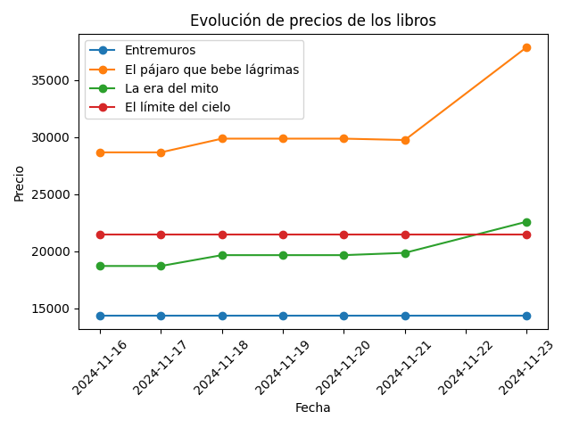
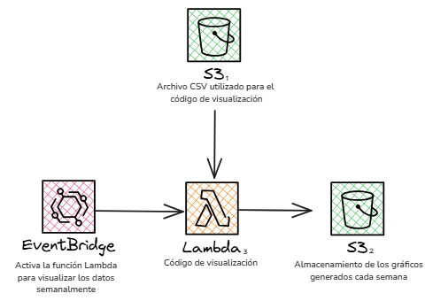

# Monitoreo de precios de libros de mi Wishlist de Buscalibre ✨

Este es un proyecto desarrollado para el Bootcamp de Latinas in Cloud.
La idea consiste en utilizar el lenguaje python para crear el código del proyecto y usar los servicios de AWS para su ejecución.

El objetivo de este proyecto es recolectar datos diariamente de los precios 4 libros que me interesa comprar y que se envíe una notificación cuando se detecte una bajada de precio en alguno de los libros.
Además, quiero poder visualizar semanalmente un gráfico que me muestre los precios de los 4 libros en función de las fechas en que se recolectaron los datos.
Por el momento, el código (**_Monitore_precios_**) solo extrae el precio de los libros de interés desde la página de buscalibre y guarda los datos (Título, precio y fecha) en un archivo CSV (no tengo nada automatizado aún, solo ejecución manual).
También tengo un código aparte para la visualización de los datos (_**Visualización_precios)**_, lo que me permite generar un gráfico para ver la evolución de los precios en el tiempo.

A continuación dejo los detalles del proyecto, un esquema de cómo sería la arquitectura en AWS (teóricamente) y lo que queda pendiente del proyecto.

## Requerimientos:

Para este proyecto se utilizaron las siguientes librerías/módulos/paquetes:

- **requests**: se utiliza para realizar solicitudes HTTP a páginas web. En este caso se utilizó para enviar solicitudes GET a las URLs de los libros en Buscalibre y obtener el HTML de la página correspondiente.
- **beautufilsoup4**: sirve para extraer datos de archivos HTML. En este proyecto se usó para buscar y extraer elementos específicos (en este caso el elemento <_scripts_> que contiene el objeto "_datalayer_").
- **re**: módulo que permite buscar patrones en cadena de texto mediante expresiones regulares. En este proyecto se utilizó para buscar dentro del contenido del <_script_> "datalayer" del HTML el valor del precio con un patrón específico.
- **pandas**: se utiliza para manipular y analizar datos. En este caso se emplea para crear y manipular DataFrames, que permiten almacenar los datos de los libros y los precios en un archivo CSV. También se usa para leer y concaternar los datos cuando se agregar nuevas entradas al archivo.
- **datetime**: módulo que se usa para manejar fechas y horas. En el proyecto se utilizó para registrar la fecha actual cuando se almacena u nuevo precio en el archivo CSV, permitiendo tener la información para rastrear la evolución de los precios en el tiempo.
- **matplotlib**: se usa para crear gráficos y visualizaciones. En este caso se utilizó para graficar la evolución de los precios de los libros a lo largo del tiempo.

## Pasos

### 1. Obtener el HTML de las páginas de los libros en mi lista de deseos

```
def obtener_html(url):
    headers = {
        'User-Agent': 'Mozilla/5.0 (Windows NT 10.0; Win64; x64) AppleWebKit/537.36 (KHTML, like Gecko) Chrome/91.0.4472.124 Safari/537.36'
    }
    response = requests.get(url, headers=headers`
    
    if response.status_code == 200:
        return response.text
    else:
        print(f"Error al obtener la página: {response.status_code} para la URL: {url}")
        return None
```

Esta sección del código se utiliza para definir la función que se usará para hacer una solicitud HTTP a la URL proporcionada y obtener el contenido de la página.
`"User-Agent"` es una cadena que identifica al cliente que hace la solicitud, simula un navegador web.
`requests.get()` envía una solicitud HTTP GET a la URL proporcionada. 
El argumento headers=headers se pasa para incluir las cabeceras definidas en la solicitud, haciendo que parezca que la solicitud proviene de un navegador.
`response.status_code` devuelve el código de estado de la respuesta HTTP. Un código 200 significa que la solicitud fue exitosa y la página se cargó correctamente.
Si el código es 200, la función devuelve response.text, que es el contenido HTML de la página como un string.
Si la solicitud no es exitosa (código diferente de 200), se imprime un mensaje de error con el código de estado y la función devuelve `None`.

### 2. Función para extraer el precio

```
def extraer_precio(html):
    soup = BeautifulSoup(html, 'html.parser')


    script_tag = soup.find('script', string=re.compile('dataLayer')) #Busca el script que contiene dataLayer

    if script_tag:
        # Usar una expresión regular para extraer el precio del script
        match = re.search(r"'precio_producto':\s*'(\d+)'", script_tag.string)
        if match:
            precio = match.group(1)  # Captura el valor del precio
            return int(precio)
        else:
            print("No se pudo encontrar el precio en el script.")
            return None
    else:
        print("No se encontró el script de dataLayer.")
        return None```
``` 
### 3. Función para registrar el precio en un archivo CSV

```
def registrar_precio(libro, precio):
    fecha = datetime.now().strftime('%Y-%m-%d')
    data = {'Fecha': [fecha], 'Libro': [libro], 'Precio': [precio]}`

    df = pd.DataFrame(data)

    # Guardar o añadir al archivo CSV
    try:
        df_existing = pd.read_csv('precios_libros.csv')
        df = pd.concat([df_existing, df], ignore_index=True)
    except FileNotFoundError:
        pass

    df.to_csv('precios_libros.csv', index=False)
```

## 4. Definir la lista de URLs de los libros de mi lista de deseos
```
libros = [
    {"titulo": "Entremuros", "url": "https://www.buscalibre.cl/libro-entremuros/9789878474458/p/54393883"},
    {"titulo": "El pájaro que bebe lágrimas", "url": "https://www.buscalibre.cl/libro-el-pajaro-que-bebe-lagrimas-n-01-04-el-corazon-del-naga/9788445017098/p/62013231"},
    {"titulo": "La era del mito", "url": "https://www.buscalibre.cl/libro-la-era-del-mito/9789583056949/p/50543764"},
    {"titulo": "El límite del cielo", "url": "https://www.buscalibre.cl/libro-el-limite-del-cielo/9788410163171/p/56764769"}
]
```
### 5. Iterar sobra cada URL y procesar los datos

```
for libro in libros:
    html = obtener_html(libro["url"])
    if html:
        precio = extraer_precio(html)
        if precio:
            registrar_precio(libro["titulo"], precio)
            print(f"El precio de '{libro['titulo']}' es: {precio}")
        else:
            print(f"No se pudo extraer el precio para el libro: {libro['titulo']}")
    else:
        print(f"No se pudo obtener el HTML para el libro: {libro['titulo']}")
```
### 6. Visualización de los precios

Al inicio tenía este bloque de código en el archivo de Monitoreo_precios, que es el script que extrae los precios, pero decidí dejarlo aparte para poder ejecutarlo de manera semanal (con EventBridge) a diferencia del monitoreo de precios que quiero que se haga diariamente.

#Función para visualizar la evolución de los precios

```
import pandas as pd
import matplotlib.pyplot as plt

def visualizar_evolucion():
    df = pd.read_csv('precios_libros.csv')```

    # Convertir la columna 'Fecha' a tipo datetime
    df['Fecha'] = pd.to_datetime(df['Fecha'])

    # Agrupar por título de libro y graficar cada uno
    for libro in df['Libro'].unique():
        df_libro = df[df['Libro'] == libro]
        plt.plot(df_libro['Fecha'], df_libro['Precio'], marker='o', label=libro)

    # Configuración del gráfico
    plt.xlabel('Fecha')
    plt.ylabel('Precio')
    plt.title('Evolución de precios de los libros')
    plt.legend()
    plt.xticks(rotation=45)
    plt.tight_layout()

    # Mostrar el gráfico
    plt.show()

# Llamada a la función para visualizar el gráfico
visualizar_evolucion()
```
Acá hay un pequeño ejemplo de visualización:



### Arquitectura en AWS (teórico)
Separé el proyecto en 2 partes: una de recolección, almacenamiento de datos, y notificación de bajada de precios y otra parte de visualización de la información.

Acá hay un pequeño diagrama de cómo sería la arquitectura del proyecto:


En este primer caso, se configura **EventBridge** para que active la fución Lambda (1) que se encarga de recolectar los datos de los precios de manera diaria.
La función **Lambda (1)** contiene el código para extraer los datos necesarios de las URLs de los libros (como título, precio y fecha de recolección) y los almacena en un archivo CSV que se guardará en un bucket **S3 (1)**.
Los datos obtenidos también se guardarán en una tabla en **DynamoDB**. Si se detecta una bajada de precio, se puede configurar para que escriba un atributo adicional en DynamoDB que indique este evento.
**DynamoDB Stream** verifica si hay un evento de bajada de precio y activa una función Lambda (2) en caso de detectar una baja de precio.
La siguiente función **Lambda (2)**, que se activa por la verificación de DynamoDB Stream, contiene el código para un SNS que permite notificar esta bajada de precio. 




Para este segundo caso, está el tema de la visualización de los datos.
La idea es generar gráficos de manera semanal y no diariamente como el caso de la recolección de los datos.
Se configura **EventBridge** para que active la función Lambda de visualización.
Esta función **Lambda (3)** utiliza el archivo CSV almacenado en el bucket **S3 (1)** de la imagen anterior para generar un gráfico que muestre los precios de cada libro en función de las fechas de recolección de datos.
Finalmente, estos gráficos semanales serán almacendados en formato png en otro bucket **S3 (2)**.

### Tareas pendientes

- Me gustaría modificar la parte de la visualización para tener un gráfico más bonito.
- Tengo pendiente toda la parte de AWS.
- Debo configurar EventBridge para activar las diferentes funciones.
- Me falta integrar la parte de DynamoDB en el código de *Monitoreo_precio*s.
- También tengo que escribir el código necesario para hacer el sistema de notificación.
- Debo adaptar el código que ya tengo para el monitoreo de precios a los servicios de AWS en general.


### Últimas acotaciones
Me imagino que todo esto podría hacerse en un solo gran código y quizás no depender de tantas funciones Lambda, pero por el momento esta era la forma más fácil que tenía mi cerebro para procesar toda esta información.
Seguiré estudiando para poder agregar lo que me falta y que quede completamente funcional y para poder implementar mejoras al proyecto en general.

Muchas gracias a las chicas que impartieron el bootcamp. Pude confirmar que esto es algo que me gusta y me entretiene mucho y que definitivamente quiero seguir aprendiendo 💖